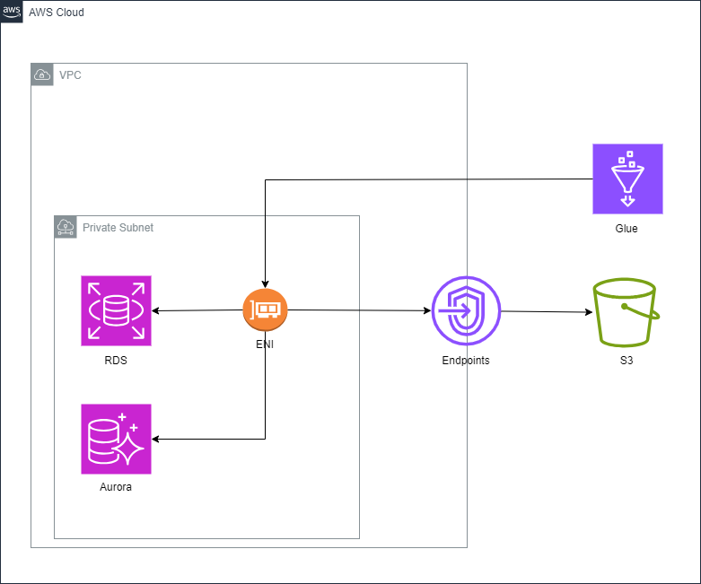
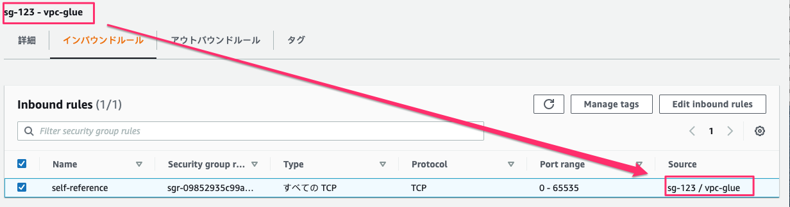
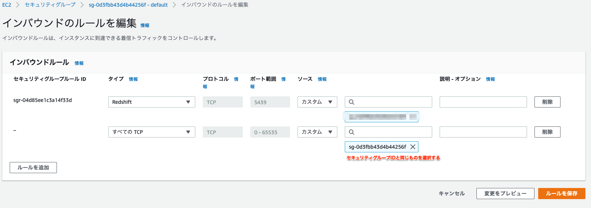

# AWS Glue でデータベースの移行を行う(RDS⇒Aurora)



---

### ⓵ AWS Glue が引き受ける IAM ロールを作成する

- AWS Glue は一時的な作業場所として S3 を使用するため、S3 へのアクセスを許可する必要がある
- ソースやターゲットとするデータストアが AWS サービスの場合はそのサービスへのアクセスも許可する必要がある

1. 以下の設定で IAM ロールを作成（フルアクセス権限の許可ポリシーを選択）

   名前：AWSGlueServiceRole-for-data-migration

   信頼されたエンティティ：glue.amazonaws.com

   許可ポリシー：

   - AWSGlueServiceRole
   - AmazonS3FullAccess
   - AmazonRDSFullAccess

★IAM ロール名のプレフィックスは _AWSGlueServiceRole_ とすることが必須

### ⓶ S3 用 VPC エンドポイントの作成

- Glue ジョブはスクリプトの取得や実行結果の管理のために、S3 アクセスが必要
- AWS Glue Crawler を使う際にも AWS Glue Crawler から S3 へアクセスが必要

★ 今回の環境はプライベートサブネットのため S3 VPC ゲートウェイエンドポイントを作成し、このエンドポイント経由で S3 へアクセスさせる

手順 1）VPC ＞ エンドポイントに進む。

手順 2）エンドポイントの作成を押下してエンドポイントの作成に進む。

手順 3）エンドポイントの設定を行い、エンドポイントの作成を押下してエンドポイントを作成する。

- エンドポイントの設定

  - 名前タグ : gateway-endpoint-glue
  - サービスカテゴリ : AWS のサービスを選択

- サービス
  - タイプ列が Gateway の com.amazonaws.{リージョン名}.s3 を選択する
- VPC
  - VPC エンドポイントを作成する (DB と同じ) VPC を選択する

---

### ⓷ ジョブ実行 ENI 用セキュリティグループの作成

1. Glue ジョブを VPC 内で実行する時に利用するネットワークインターフェイス(ENI)向けのセキュリティグループを作成する

- このセキュリティグループでは、自己参照型のインバウンドルール（自分自身をソースとする任意のポートの任意の TCP を許可するルール）を追加する

  - セキュリティグループ名：vpc-glue
    -VPC：DB と同じ VPC を選択する

  | タイプ       | プロトコル | ポート範囲 | ソース                            |
  | ------------ | ---------- | ---------- | --------------------------------- |
  | すべての TCP | TCP        | 0-65535    | 自分自身のセキュリティグループ ID |

  

---

### ⓷ セキュリティグループの設定

- AWS Glue Crawler で RDS へ接続するのでそのアクセスを許可する必要がある

1. RDS に付与されているセキュリティグループにすべての TCP に対する自己参照型のインバウンドルールを設定する

2. 作成した RDS のセキュリティグループのインバウンドルールタブを押下しインバウンドのルール編集を選択する

3. ルールを追加を押下し、すべての TCP に対する自己参照型のインバウンドルールを設定する

   - タイプ : すべての TCP を選択

   - ソース : カスタムを選択し セキュリティグループ ID と同じものを入力

   

★② で作成したセキュリティグループを RDS に追加でアタッチしても接続が成功した

---

### ④ AWS Glue 接続を作成する

1. Connections > Create connection を選択
2. 接続の追加を押下して接続作成に進む(JDBC 接続に必要な情報を入力)

   - Name：test_connection
   - JDBC URL：jdbc:mysqsl//(RDS のエンドポイント):3306/(データベース名)

     データベースエンジンにより URL の記載方法が異なるので下記参照

     [AWS Glue JDBC 接続プロパティ](https://docs.aws.amazon.com/ja_jp/glue/latest/dg/connection-properties.html#connection-properties-jdbc)

   - 接続したいデータベースの username と password を入力する

3. ネットワークの設定

   - VPC：DB のある VPC を選択
   - Subnet： DB に到達可能なサブネットを選択
   - Security Group：先ほど作成したセキュリティグループ (vpc-glue) を選択

4. Create connection を押下し、Actions>Test connection で接続が通るか確認する

---

### ⑤ AWS Glue データベースを作成する

1. Databases > Add database を選択
2. Name：test_db (現行で使用しているデータベース名をそのまま利用、任意の名前で OK)

---

### ⑥ クローラーを作成し、RDS からメタデータを読み出す

1. Crawlers > Create crawler を選択
2. Glue Data テーブルを作成していないため Not yet を選択し、Data sources 欄の右上の Add a data source を選択

   - Data source：JDBC
   - Connection：④ で作成した test_connection を選択
   - Include path：情報を抽出したいデータベースを指定 (データベース ORCL 配下のすべてのテーブルをスキャンしたい場合、Include path には ORCL/%を入力)

3. クローラーが引き受ける IAM ロールに、先ほど作成した IAM ロール「AWSGlueServiceRole-for-data-migration」を選択
4. クローラーの出力先となる AWS Glue データベースに ⑤ で作成した test_db を選択し、スケジュールに On demand を選択
5. クローラーが作成されたら、RUN を押下しクローラーを実行する

---

### ⑦ AWS Glue ジョブを作成

- 移行元(RDS)の情報を取得し、編集を加え Aurora に直接書き込む方式で実施

1. 移行先のテーブルに直接書き込むため、④ で行った移行先 DB の Connection を作成する
2. ビジュアルモードで Relational DB ノードを作成 (Data Catalog table を選択)
3. SQL Query ノードで抽出条件を指定
4. 編集モードに切り替え、job.commit()の前に下記コードを追加する

   - 移行先テーブルに create table でデータを入れるテーブルを事前に作成しておく必要がある

   ```

   # 接続定義からJDBC情報を取得
   jdbc_conf = glueContext.extract_jdbc_conf(connection_name='MyConnection')

   # DynamicFrame を DataFrame に変換

   df = dropnullfields3.toDF()

   # DataFrame をテーブルに書き込み（上書きモード）

   df.write \
   .format("jdbc") \
   .option("url", jdbc_conf['url']) \
   .option("dbtable", "my_database.my_table") \
   .option("user", jdbc_conf['user']) \
   .option("password", jdbc_conf['password']) \
   .mode("append") \
   .save()

   job.commit()

   ```

※mode("overwrite")にするとデータベースにある書き込む予定のテーブルを上書きする(テーブル定義も含め)

---

<参考 URL>

[AWS Glue で RDS のデータを S3 に格納してみた + Amazon Athena で分析してみた](https://dev.classmethod.jp/articles/exporting-rds-data-to-s3-using-aws-glue-and-analyzing-the-data-using-amazon-athena/)

[AWS Glue ジョブを VPC 内で実行させる](https://dev.classmethod.jp/articles/run-aws-glue-job-inside-vpc/)

[AWS Glue Crawler で Redshift をクロールするための設定をしてみた](https://dev.classmethod.jp/articles/aws_glue_crawler_for_redshift/)

[AWS Glue で RDS にデータを上書き保存する](https://qiita.com/danishi/items/cc7f3cc8c759bc189ca0)

---

### 用語整理

#### AWS Glue Data Catalog

- AWS のメタデータストアサービス
- AWS Glue データベースや AWS Glue テーブルなどを格納している

#### AWS Glue データベース

- AWS Glue テーブルのコレクション

#### AWS Glue テーブル

- リレーショナルデータベースのテーブル定義
- テーブル属性でソースデータのロケーションを指定することができる
- ソースデータの形式は構造化データだけでなく、半構造化データである JSON や XML にも対応している

#### クローラー

- クローラーはデータストアとやり取りすることで AWS Glue テーブルを作成する
- データストアとして JDBC 接続可能なデータベースや S3 を指定できる

#### AWS Glue ジョブ

- ソースデータに接続して抽出したデータを処理し、結果を書き出すまでの一連の流れを実行するスクリプト

#### AWS Glue 接続

- データストアへの認証情報や URI などの、データストアへの接続に関する情報を格納するデータカタログオブジェクト
