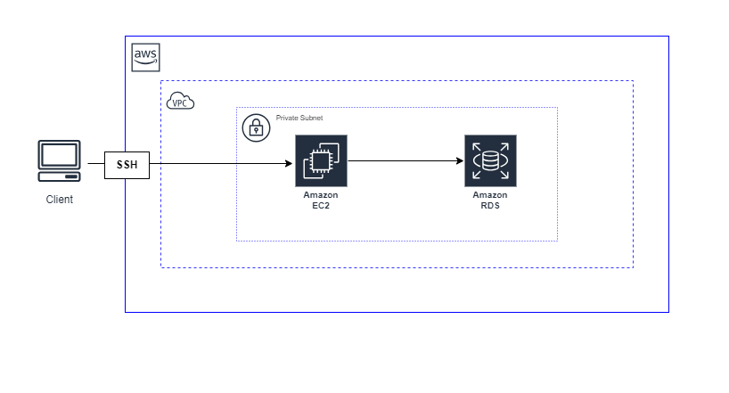

# RDS と EC2 を接続しローカルの SQL ファイルを実行する

## 

---

### ①EC2 インスタンスと RDS DB インスタンスを自動接続する

<参考 URL>

[Amazon RDS – EC2 間のワンクリック接続セットアップを試す](https://dev.classmethod.jp/articles/ec2-rds-1click/)

[EC2 インスタンスと RDS DB インスタンスを自動接続](https://dev.classmethod.jp/articles/connect-ec2-and-rds-automatically/)

---

### ②RDS に Mysql をインストールして、EC2 からログインする

1. EC2 Instance Connect で SSH 接続する（セキュリティグループで SSH を許可しておく必要あり）
2. MariaDB の MySQL コマンドラインクライアントを Amazon Linux にインストールする

   ```
   sudo dnf install mariadb105
   ```

3. MySQL コマンドラインクライアントのバージョンを確認し、Mysql がインストールされていることを確認

   ```
   mysql --version
   ```

4. RDS へ接続する（デフォルトのユーザー名：admin）

   ```
   mysql -u ＜ユーザー名＞ -p -h ＜RDSエンドポイント＞
   ```

5. Enter password：と聞かれるので RDS 作成時に設定したパスワードを入力する
6. プロンプトが下記のようになっていれば、接続が成功
   ```
   MySQL [(noen)] >
   ```

<参考 URL>

[MySQL データベースエンジンを実行している DB インスタンスへの接続](https://docs.aws.amazon.com/ja_jp/AmazonRDS/latest/UserGuide/USER_ConnectToInstance.html)

---

### ③ ローカルにある.sql ファイルを EC2 に転送する

1. ローカルのターミナルで転送コマンドを実行する（EC2 インスタンスに SSH 接続していない状態）

   ```
   scp -P 22 -i AWS_Key.pem sample.sql ec2-user@××-××-××-××:/home/ec2-user/
   ```

- ××-××-××-×× はパブリック IP アドレスを指定
- エンドポイントは/home/ec2-user/と指定すると、EC2 のルートディレクトリにファイルが転送される

  | mysql のオプション | 内容                           |
  | ------------------ | ------------------------------ |
  | -i                 | EC2 に接続する鍵               |
  | -P                 | ポート（SSH なので 22 に指定） |

---

### ④RDS で EC2 に転送したファイルを実行する

1. EC2 Instance Connect で SSH 接続する
2. _ls_ コマンドでローカルから転送したファイルがあるかを確認する
3. RDS へ接続する（②-4 のコマンド実行）
4. 転送したファイルを RDS で実行する

   ```
   source sample.sql
   ```

---

## 参考

### ★ ローカルから EC2 インスタンスに SSH 接続する

1. デスクトップに pem ファイル（.pem）をダウンロードしておく（EC2 インスタンス作成時）
2. ターミナルを開き、cd コマンドで秘密鍵ファイル(.pem)を保存した Desktop へ移動
   ```
   cd Desktop
   ```
3. chmod ( 権限設定を変更するコマンド )で秘密鍵ファイルの権限を 600 に設定
   ```
   chmod 600 AWS_Key.pem
   ```
4. ssh コマンドで ssh 接続（××-××-××-×× はパブリック IP アドレスを指定）
   ```
   ssh -i AWS_Key.pem ec2-user@××-××-××-××
   ```
5. Are you sure you want to continue connectiong ( yes/no/[fingerprint] )?と聞かれるので「yes」と入力

<br>
※【Linux】パーミッション

・読み取り権 (r) = 4

・書き込み権 (w) = 2

・実行権 (x) = 1

```
#「読み取り権」「書き込み権」「実行権」がある場合は、7
 r   w   x
 4 + 2 + 1 = 7

#「読み取り権」「書き込み権」の場合は、6
 r   w   -
 4 + 2 + 0 = 6

#「読み取り権」のみ場合は、4
 r   -   -
 4 + 0 + 0 = 4

```
