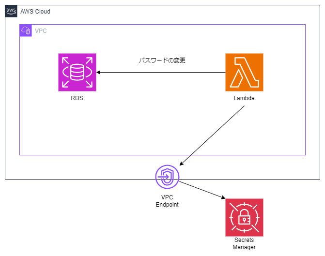

# AWS Glue でデータベースの移行を行う(パスワードのローテーション適応)

---

### ①AWS Secrets Manager で Aurora のパスワードローテーションする

1. セキュリティグループの作成

   使用するセキュリティグループは以下

- Lambda のセキュリティグループ

  - インバウンドルール:無し
  - アウトバウンドルール:フルオープン or アウトバウンドのセキュアパターンは下記

    | CIDR/SG                                 | ポート | 用途                         |
    | --------------------------------------- | ------ | ---------------------------- |
    | RDS の SG                               | 3306   | パスワード変更で接続するため |
    | VPC エンドポイント(secretsmanager)の SG | 443    | パスワード取得で接続するため |

- RDS のセキュリティグループ
  - インバウンドルールに下記を追加
    | CIDR/SG | ポート | 用途 |
    | --------------------------------------- | ------ | ---------------------------- |
    |Lambda の SG | 3306 | パスワード変更で接続するため |
  - アウトバウンドルール:フルオープン
- VPC エンドポイント(secretsmanager)のセキュリティグループ
  - インバウンドルールに下記を追加
    | CIDR/SG | ポート | 用途 |
    | --------------------------------------- | ------ | ---------------------------- |
    |Lambda の SG | 443 | パスワード変更で接続するため |
  - アウトバウンドルール:フルオープン

2. VPC エンドポイントを(secretsmanager 用)を作成

3. Secrets Manager コンソール画面からシークレットを作成

4. Lambda 関数の VPC 設定を行う

   - VPC Endpoint へ Lambda 関数が接続できるように「VPC 設定」をセキュリティグループを事前準備で作成した Lambda 用のセキュリティグループに変更する

5. 成功したローテーションの確認
   - Secrets Manager コンソールからシークレットを選択、「シークレットをローテーションさせる」を実行し、パスワードがローテーションされることを確認する

---

### ②Glue Connection において AWS Secrets Manager からシークレットを取得できるよう設定する

1. Connectors > Create connection を選択する
2. Credential type で AWS Secrets Manager を洗濯し、1-3 で作成したシークレットを選択する

※Connection の詳細な作成方法は「 AWS Glue でデータベースの移行を行う(RDS⇒Aurora)」を見る

---

<参考 URL>

[AWS Secrets Manager で RDS のパスワードローテーションしてみる](https://dev.classmethod.jp/articles/secrets-manager-password-rotation-2022/)

---
